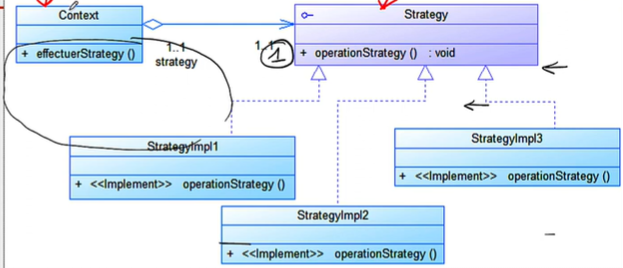

# Design Pattern - Strategy Pattern
Les Strategy patterns décrivent ainsi comment structurer des classes, organiser un groupe de classes et créer des objets. L'une des particularités du Strategy pattern réside dans le fait qu'il est possible de réaliser un comportement de programme et d'objet variable même pendant l'exécution d'un logiciel

